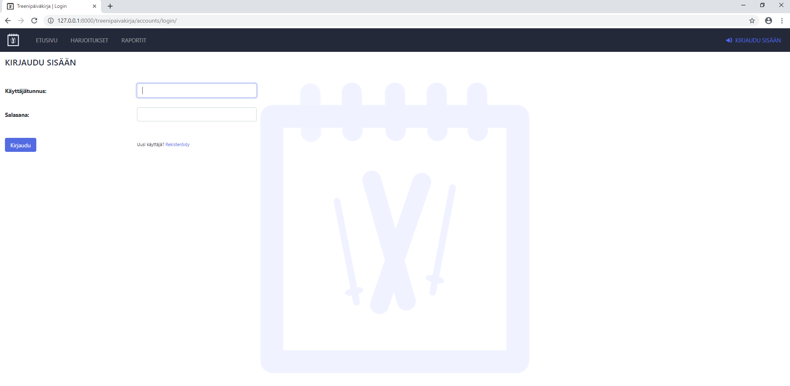
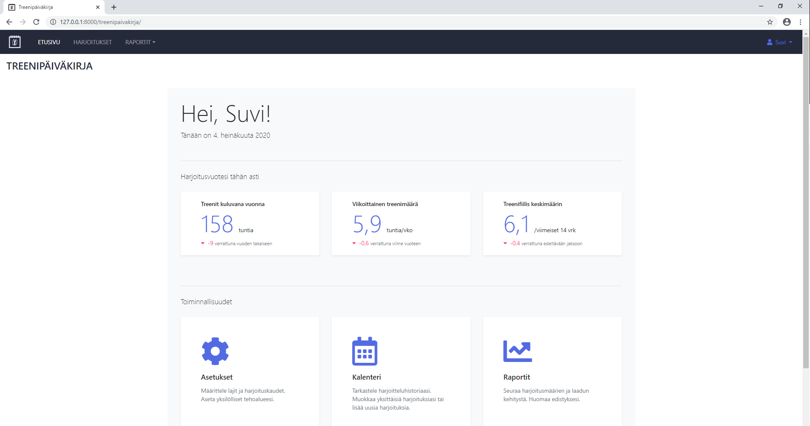
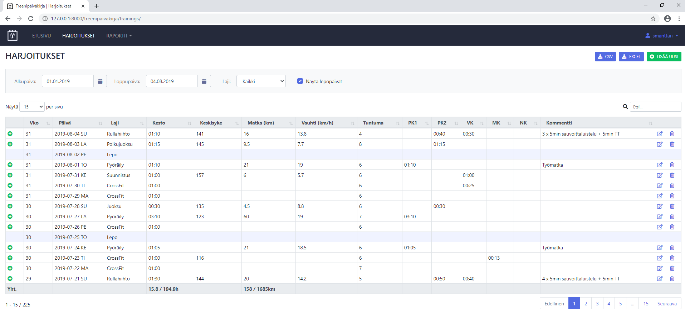
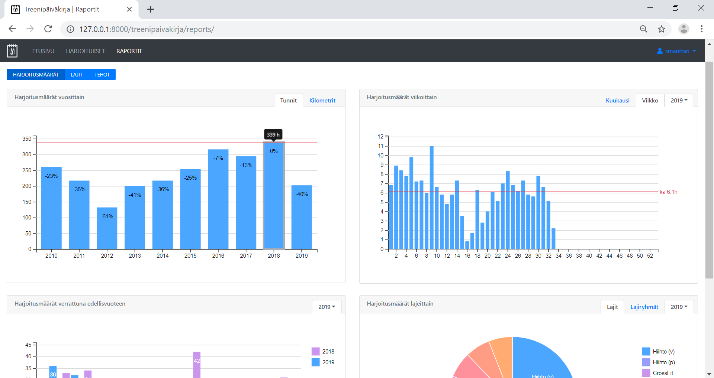
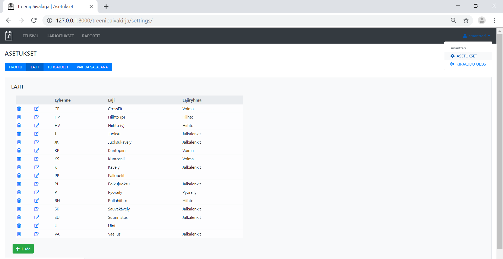

# Training Diary #

Web application for recording and analyzing trainings.

## Installation ##

* Install Python 3.6+

* Clone repository

* Install required python libraries

````
pip install -r requirements.txt
````

* Move to Treenit-folder and run database migrations

````
python manage.py migrate
````

* Import static data

````
python manage.py loaddata aika.json
````

## Getting Started ##

Start program by running following command
````
python manage.py runserver
````

Open web-browser (preferred Chrome) and go to
````
http://127.0.0.1:8000/treenipaivakirja/
````

Register a new user.



## Features ##



### Keep track of your trainings

* Input and modify trainings
* Search and investigate historical trainings
* Download training data to excel or csv



### Analyse your trainings

* Analyse your training amounts with various graphical reports



### Track your progression

* Analyse progression in each sport


### Personalise settings

* Sports and training zones can be customized to each user

