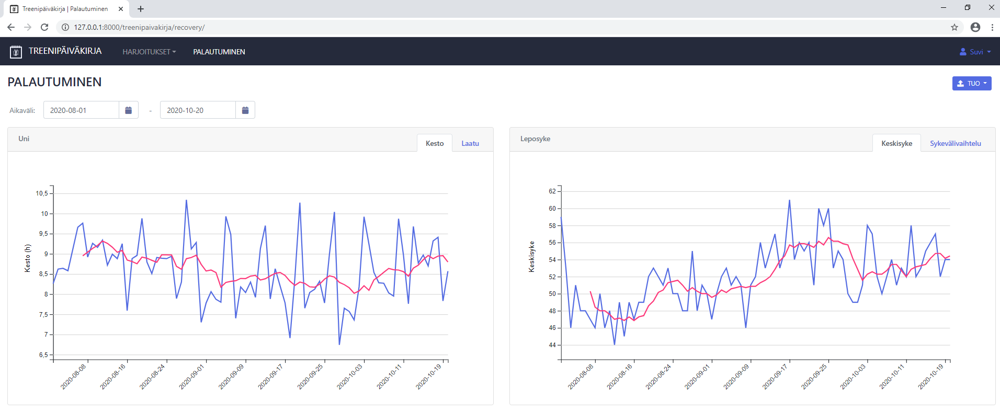

# Training App #

Web application for recording and analyzing trainings. App has direct interface to Polar: training and recovery data can be fetched through [Polar Accesslink API](https://www.polar.com/en/accesslink).

## Features ##

### Keep track of your trainings

* Input your trainings 
    * either manually or load them through Polar API
* Investigate training calendar
* Download training data into excel or csv


### Analyse your trainings

* Analyse your trainings with various graphical reports


### Follow your recovery

* Fetch sleep data from Polar
* Analyse it with recovery dashboard



### Personalise settings

* Sports, training zones and seasons can be customized for each user


## Setting up an development environment ##

* Install Python 3.6+

* Clone repository

* Move to treenit-folder and install required python libraries

````
pip install -r requirements.txt
````

* Run database migrations

````
python manage.py migrate
````

* Import static data

````
python manage.py loaddata aika.json
````

* Create **config.ini**-file to repository root with following variables (*Accesslink key is needed for interacting with Polar Accesslink API*)
````
[APP]
DEBUG = True
SECRET_KEY = your_secret_key

[ACCESSLINK]
CLIENT_KEY = 
CLIENT_SECRET = 
````

* Start app by running following command
````
python manage.py runserver
````

* Open web-browser (*preferred Chrome*) and go to
````
http://127.0.0.1:8000/treenipaivakirja/
````